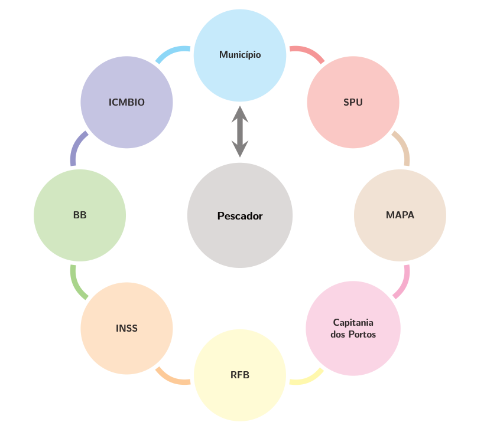

background-image: url(Capa.png)
background-size: contain

```{r setup, include=FALSE}
options(htmltools.dir.version = FALSE)
knitr::opts_chunk$set(echo = FALSE, warning = FALSE, message = FALSE,
                      fig.align = "center", out.width = "80%", fig.path = "images/",
                      eval = TRUE)
```

---

## Vetor social da concessão de TAUS para Ranchos de Pesca

<br><br><br><br><br><br>

.Large[
Preservar comunidades tradicionais de pescadores profissionais/artesanais, salvaguardando a cultura dessas comunidades.
]


---

## Alguns fatores críticos 

--

+ Os pescadores estão fisicamente distantes da SPU/SC

--

+ Os Pescadores apresentam dificuldades no acesso ao Portal Eletrônico, preferem atendimento presencial

--

+ Conflito entre a diretrizes de ordenamento costeiro do município e a necessidade de preservação das comunidades de pesca artesanal

--

+ Os pescadores precisam recorrer a 7 (sete) entes para conseguir os requisitos necessários à obtenção de TAUS

--

+ Reduzida capacidade de resposta dos órgãos públicos, quando agem de forma isolada

--

### Apontam a necessidade de mudança para uma ação articulada

---

## Impacto desses fatores críticos


--

### Volumoso passivo de pleitos na NUREF/SPU/SC

--

.full-width[.content-box-purple[.center[Processos triados - DIRFH (Set/2019) <br> 853]]]

--

.pull-left[.full-width[.content-box-yellow[.center[Processos TAUS <br> 796]]]]
.pull-right[.full-width[.content-box-green[.center[Regularização Fundiária <br> 43]]]]

--

.pull-left[
.pull-left[.full-width[.content-box-yellow[.center[Florianópolis <br> 479]]]]
.pull-right[.full-width[.content-box-yellow[.center[Demais <br> 317]]]]
]

--

.pull-right[
.pull-left[.full-width[.content-box-green[.center[REGFUND <br> 35]]]]
.pull-right[.full-width[.content-box-green[.center[REURB <br> 08]]]]
]

.footnote[Outros: 14]
---

## Vantagens da ação descentralizada

--

+ O Pescador espera que as suas necessidades sejam atendidas no próprio município.
--

+ O município perfaz a filtragem dos pleitos, evitando que demandas em desacordo com o Plano Diretor Municipal e Ambiental

--

+ A fiscalização do uso e ocupação do solo já é feita por órgãos municipais especializados (questões de planejamento urbano, defesa sanitária e ambiental).

--

+ A proteção às comunidades tradicionais de pescadores artesanais/profissionais, dentre outras minorias, é exercida pelos municípios.

---
class: inverse, center, middle

## O necessário financiamento

### O repasse aos municípios para fins de gestão do patrimônio da União

---
class: center, middle

| **MUNICÍPIOS**           | VALORES 2016 <br> (R$)  |VALORES 2017 <br> (R$)| VALORES 2016 <br> (R$)|	**TOTAL**   | 
|:-------------------------|------------------------:|---------------------:|----------------------:|------------:|
|ABELARDO LUZ       	     |       565,87 	         |       545,46 	      |       561,02 	        |     1.672,35|
|ARAQUARI	                 |    48.406,50 	         |    54.987,06 	      |   155.372,86 	        |   258.766,42|
|ARARANGUA	               |    34.368,84 	         |    35.215,11 	      |    39.291,37 	        |   108.875,32| 
|BALNEARIO ARROIO DO SILVA |     2.722,50 	         |     3.371,51 	      |     1.612,13 	        |     7.706,14|
|BALNEARIO BARRA DO SUL	   |    11.874,41 	         |    10.628,53 	      |    10.099,18 	        |    32.602,12|
|BALNEARIO CAMBORIU	       | 2.745.016,03 	         | 2.958.088,09 	      | 3.253.953,30 	        | 8.957.057,42| 
|BALNEARIO PICARRAS	       |    39.839,04 	         |    58.656,81 	      |    57.684,33 	        |   156.180,18|
|BARRA VELHA	             |    67.591,40 	         |    60.337,65 	      |    56.905,38 	        |   184.834,43|
|BIGUACU	                 |    52.794,67 	         |    59.707,32 	      |    59.681,30 	        |   172.183,29|
|BLUMENAU	                 |    26.225,69 	         |    31.269,60 	      |    -   	              |    57.495,29|
|BOMBINHAS	               |   443.421,10 	         |   492.018,09 	      |   559.070,28 	        | 1.494.509,47|
|CAMBORIU	                 |     1.053,13 	         |     1.104,89 	      |     1.653,33 	        |     3.811,35|


---
class: center, middle

| **MUNICÍPIOS**           | VALORES 2016 <br> (R$)  |VALORES 2017 <br> (R$)| VALORES 2016 <br> (R$)|	**TOTAL**   | 
|:-------------------------|------------------------:|---------------------:|----------------------:|------------:|
|FLORIANOPOLIS	           | 1.535.549,96 	         | 1.451.924,24 	      | 1.512.138,34 	        | 4.499.612,54|
|GAROPABA	                 |   122.050,11 	         |   164.691,58 	      |   131.802,86          |	  418.544,55|
|GARUVA	                   |    14.172,56 	         |    19.160,96 	      |    15.161,68 	        |    48.495,20|
|GASPAR	                   |    19.908,58 	         |    16.635,22 	      |    20.756,00 	        |    57.299,80|
|GOVERNADOR CELSO RAMOS	   |   254.864,93 	         |   282.280,03 	      |   304.220,98          |	  841.365,94|
|ICARA	                   |     5.813,07 	         |     3.466,19 	      |     5.159,67 	        |    14.438,93|
|ILHOTA	                   |     1.419,92 	         |     1.930,25 	      |     2.041,06 	        |     5.391,23|
|IMARUI	                   |     2.264,52 	         |     3.027,81 	      |     2.323,36 	        |     7.615,69|
|IMBITUBA	                 |    89.567,64 	         |   105.676,85 	      |    73.440,86 	        |   268.685,35|
|ITAJAI	                   |   450.691,37 	         |   474.342,43 	      |   504.355,68          | 1.429.389,48|
|ITAPEMA	                 |   713.729,77 	         |   720.005,73 	      |   889.400,94          | 2.323.136,44|
|ITAPOA	                   |    53.416,15 	         |    53.269,48 	      |    56.859,01 	        |   163.544,64|

---
class: center, middle

| **MUNICÍPIOS**           | VALORES 2016 <br> (R$)  |VALORES 2017 <br> (R$)| VALORES 2016 <br> (R$)|	**TOTAL**   | 
|:-------------------------|------------------------:|---------------------:|----------------------:|------------:|
|JAGUARUNA	               |       591,32 	         |     1.573,31 	      |       649,53          |     2.814,16| 
|JOINVILLE	               |   248.826,52 	         |   310.241,49 	      |   204.808,84 	        |   763.876,85|
|LAGUNA	                   |   176.855,32 	         |   195.519,36 	      |   294.704,32          |   667.079,00|
|NAVEGANTES	               |   157.187,52 	         |   179.588,11 	      |   155.266,22          |   492.041,85|
|PALHOCA	                 |   251.391,60 	         |   189.934,08 	      |   225.162,37          |   666.488,05|
|PASSO DE TORRES	         |     4.162,60 	         |     3.935,01 	      |     4.036,50          |    12.134,11|
|PENHA	                   |   249.600,46 	         |   221.967,68 	      |   276.497,46          |   748.065,60|
|PORTO BELO	               | 1.379.701,51 	         | 1.330.019,41 	      | 1.309.615,15          | 4.019.336,07| 
|SAO FRANCISCO DO SUL	     |   203.388,48 	         |   130.127,39 	      |   125.855,83          |   459.371,70|
|SÃO JOÃO DO SUL	         |     5.303,39 	         |     4.739,63 	      |     4.827,35          |    14.870,37|
|SÃO JOSE	                 |   837.542,43 	         |   644.253,86 	      |   623.197,93          | 2.104.994,22|
|SOMBRIO	                 |       258,32 	         |       761,48 	      |           -           |     1.019,80|
|TIJUCAS	                 |     8.383,65 	         |     9.104,76 	      |     8.105,55          |    25.593,96|

---

## Projeto de Descentralização e Modernização Administrativa de Regularização de Ranchos de Pesca em Santa Catarina

<br><br><br><br><br><br>

.Large[
Visa regulamentar os procedimentos entre as instituições e a regularização de ranchos, para pescadores artesanais/profissionais de Comunidades Tradicionais em Santa Catarina, de uso sustentável, com anuência do Município de Florianópolis.
]


---

## Ideal - Racionalização do processo envolvendo múltiplos atores institucionais

.pull-left[

```{r, echo = FALSE, out.width="100%"}

```

]

.pull-right[

<br><br><br><br><br><br><br><br><br><br>

+ Vantagens da Janela Única (single window) no atendimento ao Usuário do serviço público - O Decreto 9.094/2017.

+ Responsabilização da instituição de entrada por toda a cadeia do processo, desde o requerimento até a emissão de TAUS

]

---

```{r, echo = FALSE, out.width="50%"}

```

--

```{r, echo = FALSE, out.width="50%"}
knitr::include_graphics("orgaos.PNG")
```

--

```{r, echo = FALSE, out.width="50%"}

```

---

#### Projeto de Descentralização e Modernização Administrativa de Regularização de Ranchos de Pesca em Santa Catarina

##### Visa a regulamentação de procedimentos entre as instituições quanto à regularização de ranchos para pescadores artesanais ou profissionais de Comunidades Tradicionais em Santa Catarina, com anuência do Município de Florianópolis.

---

## Projeto de Descentralização e Modernização Administrativa de Regularização de Ranchos de Pesca em Santa Catarina

--

I - DIAGNÓSTICO DOS PROCESSOS DE RANCHOS DE PESCA EM TRAMITAÇÃO NA SPU, visando conhecer melhor a sua situação;

--

II - REALIZAÇÃO DO PRIMEIRO SEMINÁRIO INSTITUCIONAL SOBRE A REGULARIZAÇÃO DE RANCHOS DE PESCA EM SANTA CATARINA, visando conhecer melhor a metodologia dos instrumentos necessários;

--

III - CRIAÇÃO DOS INSTRUMENTOS NECESSÁRIOS, por meio de reuniões de trabalho com a Superintendência Federal da Pesca em Florianópolis e os Municípios (Florianópolis, Garopaba, Governador Celso Ramos e São Francisco do Sul);

--

[IV - EMISSÃO DE NOTA TÉCNICA](https://github.com/droubitech/TAUS/raw/master/01%20-%20Nota%20T%C3%A9cnica%20-%20Projeto%20de%20Descentraliza%C3%A7%C3%A3o%20e%20Moderniza%C3%A7%C3%A3o%20Administrativa.odt), para aprovação do Projeto de Descentralização e Modernização Administrativa;

--

V - MARCO REGULATÓRIO, a SPU descentralizou recursos aos municípios, mas não modernização a legislação quanto aos seus encargos provenientes desta verba; e,

--

VI - DECRETO  Nº 20.180/2019 do Município de Florianópolis, que regulamentou o marco regulatório de ranchos em seu Município. 

---
class: center, inverse, middle

## Fluxograma do Processo

---
background-image: url(fluxograma.png)
background-size: contain
---

## IV-EMISSÃO DE NOTA TÉCNICA

--

[ANEXO I-REQUERIMENTO DE RANCO DE PESCA](https://github.com/droubitech/TAUS/raw/master/ANEXO%20I-%20Requerimento%20de%20Rancho%20de%20Pesca.doc);

--

[ANEXO II-IDENTIFICAÇÃO E CARACTERIZAÇÃO DO PESCADOR DE COMUNIDADE TRADICIONAL](https://github.com/droubitech/TAUS/raw/master/ANEXO%20II%20-%20Identifica%C3%A7%C3%A3o%20e%20Carcteriza%C3%A7%C3%A3o%20de%20Pescador%20do%20Comunidade%20Tradicional.doc);

--

[ANEXO III-IDENTIFICAÇÃO E CARACTERIZAÇÃO DO USO DO SOLO/AMBIENTAL](https://github.com/droubitech/TAUS/raw/master/ANEXO%20III-%20Identifica%C3%A7%C3%A3o%20e%20Caracteriza%C3%A7%C3%A3o%20do%20Uso%20do%20Solo-Ambiental.doc);

--

[ANEXO IV-MINUTA DE TAUS](https://github.com/droubitech/TAUS/raw/master/ANEXO%20IV-%20Minuta%20de%20%20TAUS.doc);

--

[ANEXO V-ATA DE APROVAÇÃO DO PROJETO DE DESCENTRALIZAÇÃO E MODERNIZAÇÃO ADMINISTRATIVA](https://github.com/droubitech/TAUS/raw/master/ANEXO%20V%20-%20Ata%20de%20aprova%C3%A7%C3%A3o%20do%20Projeto.odt);

--

[ANEXO VI-TERMO DE HOMOLOGAÇÃO](https://github.com/droubitech/TAUS/raw/master/ANEXO%20VI%20-%20TERMO%20DE%20HOMOLOGA%C3%87%C3%83O.odt); e,

--

[ANEXO VII-FLUXOGRAMA](https://github.com/droubitech/TAUS/raw/master/ANEXO%20VII%20-%20FLUXOGRAMA.pdf).

--

[ANEXO VIII-MARCO REGULATÓRIO](https://github.com/droubitech/TAUS/raw/master/ANEXO%20VIII%20-%20Marco%20Regulat%C3%B3rio.odt)

